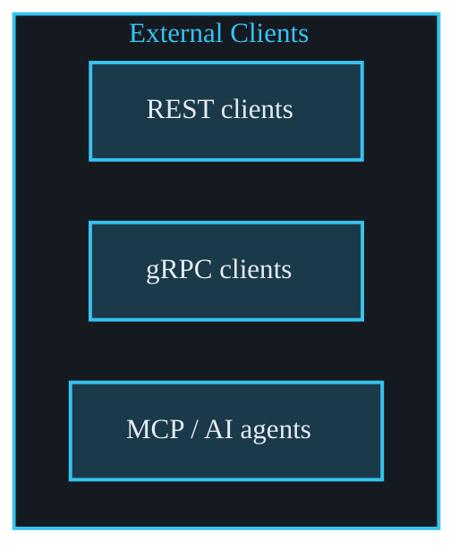
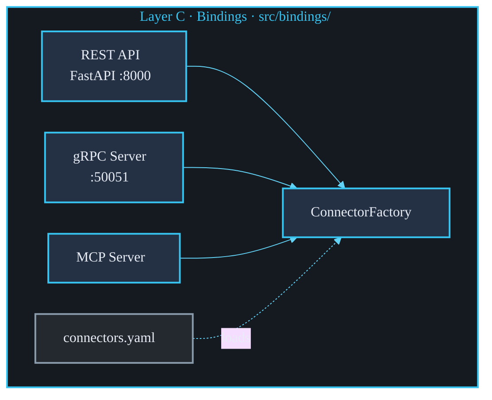
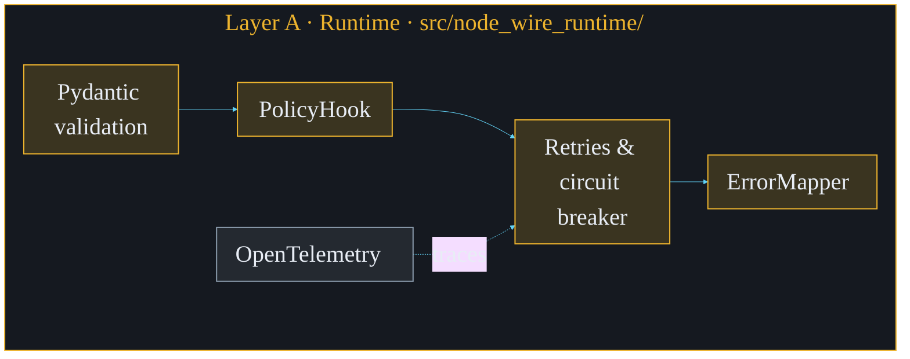
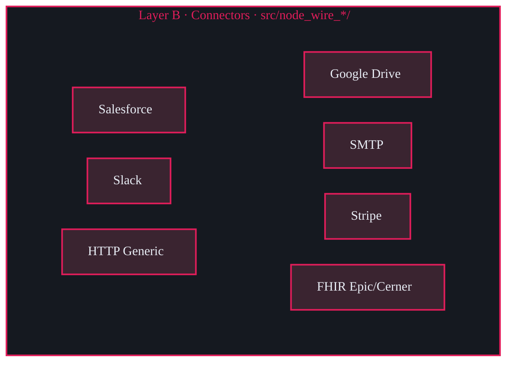
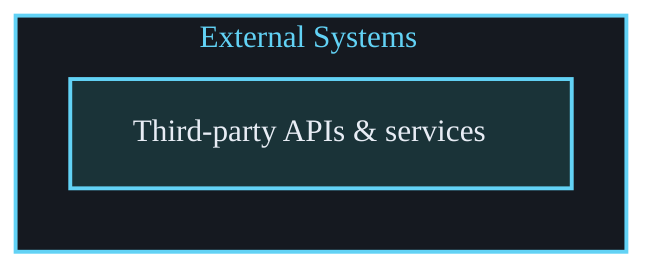

<!--
SPDX-FileCopyrightText: 2026 AOT Technologies

SPDX-License-Identifier: Apache-2.0
-->

# Node Wire Architecture

The Node Wire platform is designed as a three-layer Python platform that runs connector adapters over REST, gRPC, or MCP. Each connector talks to an external system (e.g., Google Drive, SMTP, Stripe); the runtime provides a consistent execution contract, error handling, and resilience.

## High-Level Architecture

The platform is split into three layers:

- **Layer A – Runtime** (`src/node_wire_runtime/`): The engine that every connector runs inside. It defines the execution contract, a standard error taxonomy, retries and circuit breaking, and telemetry.
- **Layer B – Connectors** (`src/node_wire_<connector>/`): Adapters that implement that contract and call external systems (HTTP Generic, SMTP, Stripe, Google Drive, FHIR Epic, FHIR Cerner, Salesforce, Slack). Each connector has its own input/output schema and business logic.
- **Layer C – Bindings** (`src/bindings/`): How the platform is exposed to the outside world—REST API, gRPC server, MCP server—and how connectors are loaded from configuration (ConnectorFactory + `config/connectors.yaml`).

requests ↓

ConnectorFactory ↓

BaseConnector.run ↓

outbound calls ↓

↑ ConnectorResponse returns through Layer C to clients

### Data Flow (Simplified)

1. A request arrives via REST, gRPC, or MCP.
2. The `ConnectorFactory` resolves the right connector.
3. The runtime runs the connector:
   - Validate input via Pydantic.
   - Optional policy check.
   - Retry/circuit-breaker wrapper (resilience).
   - Execute internal logic.
   - Map any exceptions to the standard error taxonomy.
4. The response is returned in a standard shape (`ConnectorResponse`).

---

## Layer A – `runtime`

**Purpose:** Provide shared execution and reliability so every connector behaves in a consistent way (validation, errors, retries, telemetry) without each connector reimplementing the same plumbing.

**Location:** `src/node_wire_runtime/`

### Main Components

- **BaseConnector**: Abstract base class for all connectors. It handles the `run()` method pipeline.
- **ConnectorResponse / ErrorCategory**: Unified response shape and error categorization (`RETRYABLE`, `BUSINESS`, `AUTH`, `FATAL`).
- **ErrorMapper**: Maps exception types to stable error codes and categories.
- **Resilience**: Decorators for retries (Tenacity) and circuit breaking (PyBreaker).
- **SecretProvider**: Abstraction for fetching secrets (API keys, credentials).
- **PolicyHook**: Optional hook to allow or deny execution based on principal or tenant.
- **Telemetry**: OpenTelemetry integration for tracing.

---

## Layer B – `connectors`

**Purpose:** System adapters that talk to external services. Each connector defines input/output models and implements `internal_execute`.

**Location:** `src/node_wire_<name>/`

### Common Structure

- `schema.py`: Pydantic models for request and response.
- `logic.py`: Connector class and external service logic.
- `registration.py`: Registers connector-specific exceptions.

---

## Layer C – `bindings`

**Purpose:** Expose connectors over different protocols and load them from configuration.

**Location:** `src/bindings/`

### Bindings Offered

- **REST API (FastAPI)**: Dynamic routes at `POST /connectors/{connector_id}/{action}`.
- **gRPC Server**: Protocol buffers based interface on port 50051.
- **MCP Server**: Model Context Protocol implementation for AI agents.
