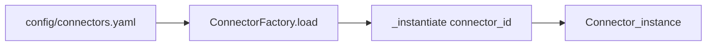

# Creating a connector in Node Wire

This guide explains how to implement a new connector (Layer B) and make it available via REST/gRPC/MCP (Layer C).

## How connectors plug into the platform

- **Layer B (`src/connectors/`)**: connector implementations (schemas + logic).
- **Layer C (`src/bindings/`)**: protocol bindings and configuration-driven loading.

At startup, the REST binding:

- Imports connector `registration.py` modules via `connectors.auto_register()` so exceptions can be mapped.
- Loads and instantiates enabled connectors via `ConnectorFactory` using `config/connectors.yaml`.

## Connector shape (single-action)

Most connectors are a single `BaseConnector` subclass with:

- `connector_id`: stable identifier (used in URLs and config)
- `action`: the action name (used in URLs and manifests)
- `schema.py`: Pydantic input/output models
- `logic.py`: connector implementation (`internal_execute`)
- `registration.py` (optional): register exception mappings for runtime error taxonomy

Use the `http_generic` connector as a reference:

- `src/connectors/http_generic/schema.py`
- `src/connectors/http_generic/logic.py`
- `src/connectors/http_generic/registration.py` (if present)

### Minimal checklist (single-action)

1. Create a new package: `src/connectors/<your_connector>/`.
2. Define request/response models in `schema.py`.
3. Implement `logic.py` with a `BaseConnector[...]` subclass:
   - set `connector_id = "<your_connector>"`
   - set `action = "<your_action>"`
   - implement `internal_execute(self, params, *, trace_id)`
4. If you raise connector-specific exceptions, add `registration.py` and register them with the runtime `ErrorMapper` so clients get stable `error_code`/`error_category`.

## Connector shape (multi-action)

Some connectors expose multiple actions from a single logical integration (e.g. FHIR). In that pattern, the factory stores **one** object under a `connector_id`, and that object exposes:

- `list_actions() -> list[BaseConnector]`
- `get_action(name: str) -> BaseConnector | None`

The factory uses these helpers for discovery and dispatch.

See the Epic FHIR connector implementation for the pattern:

- `src/connectors/fhir_epic/logic.py` (`FhirEpicConnector`, `_FhirAction`, `list_actions()`, `get_action()`)

## Wire the connector into the runtime (required)

There are two places to update so the platform can load and expose your connector.

### 1) Add an entry to `config/connectors.yaml`

Add a new block under `connectors:`:

```yaml
connectors:
  my_connector:
    enabled: true
    exposed_via: ["rest", "grpc", "mcp"]
```

- `enabled: true` controls whether the connector is instantiated.
- `exposed_via` controls which protocols can see it.

If `enabled` is false, or if a protocol is missing from `exposed_via`, you will see “not configured / not available” errors even if your `.env` is correct.

### 2) Add factory wiring in `src/bindings/factory.py`

`ConnectorFactory` instantiates connectors via `_instantiate(connector_id)`. Add a branch for your `connector_id` that returns your connector instance and passes the `secret_provider`.

For single-action connectors, the factory typically passes the input/output model classes too (example: `http_generic`, `google_drive`).

For multi-action connectors, the factory stores one instance (example: `fhir_epic`, `fhir_cerner`), and `get_for_protocol()` uses `get_action()` when an action is requested.

## Registration (`registration.py`)

`connectors.auto_register()` imports `registration` modules from connector subpackages automatically:

- A connector package may omit `registration.py` if it doesn’t need custom exception mapping.
- If present, `registration.py` should register exception types with the runtime error taxonomy so clients get predictable categories (`BUSINESS`, `AUTH`, `RETRYABLE`, `FATAL`).

See `src/connectors/__init__.py` for the auto-discovery behavior.

## Secrets and configuration conventions

- Connector secrets are read via the `SecretProvider` (`self.secret_provider.get_secret("KEY")`).
- For local development, secrets are typically defined in `.env` using the names in `sample.env`.
- The platform’s `EnvSecretProvider` is case-insensitive (it checks both `KEY` and `key`), but prefer **one canonical spelling** in documentation and config.

## How exposure works per protocol

The REST binding exposes:

- `POST /connectors/{connector_id}/{action}`

Routes and schemas come from the connector manifest built over the factory’s `list_for_protocol("rest")` output.

The same `enabled` / `exposed_via` gating applies to gRPC and the built-in MCP-style manifest.

## Optional: MCP tools for ToolHive / agents

This repository also includes MCP servers under `src/agents/` (for ToolHive and other MCP clients). These are separate from the REST/gRPC bindings:

- **Combined MCP server**: `python -m agents.mcp_entrypoint`
- **Per-connector MCP servers**: `python -m agents.<connector>_mcp` (see `docs/mcp-servers.md`)

Adding a connector to the runtime (factory + YAML) does not automatically create a ToolHive-ready MCP server. If you need MCP tools, you typically add a small wrapper in `src/agents/` that calls into the connector via `ConnectorFactory`.

## Loading flow (simplified)



