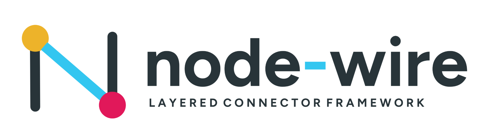

<!--
SPDX-FileCopyrightText: 2026 AOT Technologies

SPDX-License-Identifier: Apache-2.0
-->

# node wire

[](https://github.com/AOT-Technologies/node-wire/actions/workflows/pytest.yml)
[](https://github.com/AOT-Technologies/node-wire/actions/workflows/codeql.yml)
[](https://pypi.org/project/node-wire/)
[](https://github.com/AOT-Technologies/node-wire/releases/latest)
[](https://github.com/AOT-Technologies/node-wire/blob/main/LICENSE)

<p align="center">
  
</p>

node wire is a three-layer Python platform that runs connector adapters (Google Drive, SMTP, Stripe, FHIR, Salesforce, Slack, and more) and exposes them over REST, gRPC, or MCP. It provides a consistent execution contract with built-in validation, resilience, and telemetry.

## Prerequisites

Before getting started, see the [Installation guide](installation.md) for full setup. You will need Python 3.11+, `uv` (recommended) or `pip`, Git, and optionally Docker (MCP server images) and Node.js (MCP Inspector).

## Quick Start

```bash
git clone https://github.com/AOT-Technologies/node-wire.git
cd node-wire
uv sync --frozen --all-extras --dev
cp sample.env .env
MODE=API uv run node-wire
```

Open [http://localhost:8000/docs](http://localhost:8000/docs) for the Swagger UI, or the [playground](http://localhost:8000/playground/) for interactive connector demos.

## Key Sections

<div class="grid cards" markdown>

-   **Getting Started**

    Set up your environment and configure connectors.

    [:octicons-arrow-right-24: Installation](installation.md)

-   **Architecture**

    Understand the three-layer design: Runtime, Connectors, and Bindings.

    [:octicons-arrow-right-24: Architecture](architecture.md)

-   **Connectors**

    Build or configure integrations with Google Drive, Salesforce, Slack, and more.

    [:octicons-arrow-right-24: Connectors Guide](connectors.md)

-   **MCP Integration**

    Deploy connectors as Model Context Protocol servers for AI agents.

    [:octicons-arrow-right-24: MCP Overview](mcp.md)

</div>

## Available Connectors

| Connector | Protocol | Doc |
|---|---|---|
| Google Drive | REST + OAuth | [Guide](google_drive_connector.md) |
| Salesforce | REST | [Guide](salesforce_connector.md) |
| Slack | Events API | [Guide](slack_connector.md) |
| SMTP | Email | [Connectors](connectors.md) |
| Stripe | REST | [Connectors](connectors.md) |
| FHIR Epic | SMART on FHIR | [Connectors](connectors.md) |
| FHIR Cerner | SMART on FHIR | [Connectors](connectors.md) |
| HTTP Generic | REST bridge | [Connectors](connectors.md) |

## Contributing

Contributions are welcome. See the [Contributing guide](contributing.md) for development setup, quality checks, and DCO requirements.
